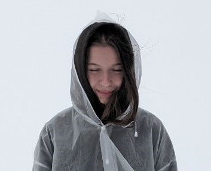

# Lada Volgina's CV



## Full Name

Lada Volgina

## Contact Information

- Phone number: +79090287069
- Email: ladavolginaa@gmail.com
- Discord: ladavolgina
- GitHub: ladavolgina

## Brief Self-Introduction

**Goals and Priorities:** I am focused on developing my career as a frontend developer, striving for continuous growth of professional skills and participation in exciting projects.

**Strengths:** My strengths include a passion for JavaScript programming, a creative approach to interface design, and the ability to quickly learn new technologies. My experience working in a game development studio has provided valuable experience in interface design.

**Work Experience:** I am a beginner frontend developer with experience working in a game development studio as an interface designer. My experience in this field has allowed me to understand the importance of an intuitive user experience and attention to detail.

**Desire to Learn and Acquire New Skills:** I am determined to deepen my knowledge in frontend development and improve my skills. My education in dog training demonstrates my ability to learn and adapt to new fields.

This is a brief summary about me for a CV, covering my goals, strengths, work experience, and desire to learn and grow in the chosen field.

## Skills

**Programming languages:** JS, Python

**Platforms:** GitHub

**Version Control Systems:** Git, SVN

**Developer Tools:** VS Code, Chrome dev. tools, Figma

**Other:** HTML, CSS, XML

## Code Examples

[My Codewars Profile](https://www.codewars.com/users/ladavolgina/completed)

```js
function boolToWord( bool ){
  if (bool === true){
    return "Yes";
  }  else {
    return "No";
    }
}
```

## Work Experience

**Targem Games** - UX/UI Designer. (Oct. 2022 - Mar. 2023)

**SKB Kontur** - Database operator. (Mar. 2022 - Sen. 2022)

[**My CV project**](https://github.com/ladavolgina/rsschool-cv)

## Education

- RS School (stage 0)
- RS School (stage 1)

## English Language

B1
